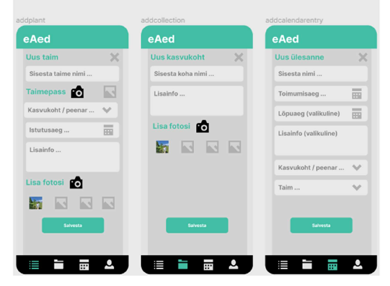

# AEDNIKU RAKENDUSE LOOMINE

**Autor**: Siim Seppi

**Juhendaja**: MSc Argo Ilves

## SISSEJUHATUS

Eesti inimesed on ikka rohelust ja maaelu au sees hoidnud. Kevadel on aianduspoodides uute
taimede taimede järgi suur nõudlus, nädalavahetustel toimuvad menukad laadad. Ainuüksi igaaasta
korraldataval Türi Lillelaadal on 30 000 külastajat ja 700 müüjat. (Türi Aianduse ja
Mesinduse Selts, s.a.)

Aiandus on paljudele hobiks, näiteks sotsiaalmeedia portaali Facebook kõige suurema
eestlastest liikmeskonnaga grupp “Aiaelu” omab üle 70 000 liikme. (Facebook, s.a.).
Statistikaamet on uurinud harrastusi üle 15 a vanustel, viimase 12 kuu harrastusteks on
märkinud aianduse 41 000 inimest. (Statistikaamet, 2015)

Möödunud pandeemia ajal otsustati viiruse leviku piiramiseks sulgeda peale kinode ja teatrite
ka aianduspoed. Mõned riigid leidsid, et inimeste vaimse tervise jaoks on aiandusega
tegelemine oluline ja poed jäeti lahti. Eestis tegid aga aiandusliidud ja -ettevõtted
ühispöördumise peaministrile poodide avamiseks, väites, et aiandusega tegelemine on
inimestele mentaalselt oluline. (Maaleht, 2021) Aianduse kasulikkusest inimeste tervisele on
tehtud kümneid teadusuuringuid, välja tuuakse positiivne mõju mitte ainult vaimsele vaid ka
füüsilise tervisele. Soovitatakse isegi muuta riiklikku poliitikat, et innustada inimesi rohkem
aiandusega tegelema. See tooks rahvale parema tervise ja riigile madalama kulu tervishoius.
(Soga et al, 2017)

Sarnaselt teiste hobidega, muutub ka aiandus sageli kollektsioneerimiseks. Pideva sordiaretuse
tulemusena on taimede valik väga lai, näiteks populaarses Juhani Puukoolis müüakse 69 sorti
õunapuid, 45 sorti kadakaid. (Juhani Puukool) Sortidel on erinevad omadused, näiteks viljade
valmimisaeg, maitse, välimus. Lisaks on eri sortidel erinevad vajadused, näiteks veevajadus,
mullatüüp, päikesekiirguse intensiivsus, väetamised.

Maalehes väidetakse kõige käepärasemaks aiapäevikuks tavaline kalender, kuhu saab vajalikud
tööd ja tegemised üles märkida. (Marjapuu, 2021) Tänapäeva nutitelefonide ajastul, kus pea
kõigil on taskus väga võimekas kaamera, annaks rakendus kasutajale võimaluse tegeleda oma
hobiga interaktiivsemalt ja mugavamalt. Selline eestikeelne rakendus hetkel puudub.

Diplomitöö eesmärgiks on luua rakendus, millega saab (hobi)aednik oma aias kasvavad
erinevad taimed üles märkida, lisada neile juurde fotosid ning teha erinevaid sissekandeid ehk
pidada aiapäevikut.

### Uurimisküsimused:
- Kuidas hallatakse hetkel taimede kohta informatsiooni, millised oleks vajadused
rakendusele - intervjuud aiapidajatega.
- Millised analoogsed rakendused on olemas, nende analüüs.
- Milliseid tehnoloogiaid kasutada rakenduse loomiseks.

Töö esimeses, teoreetilises osas töötatakse läbi uurimisküsimused.
Teises, praktilises osas kirjeldatakse rakenduse loomise protsessi, lisaks antakse ülevaade rakenduse testimisest ja võimalikest edasiarendustest.

### Täistekst
[Täistekst pdf-failina](./Siim%20Seppi%20-%20Diplomit%C3%B6%C3%B6.pdf)