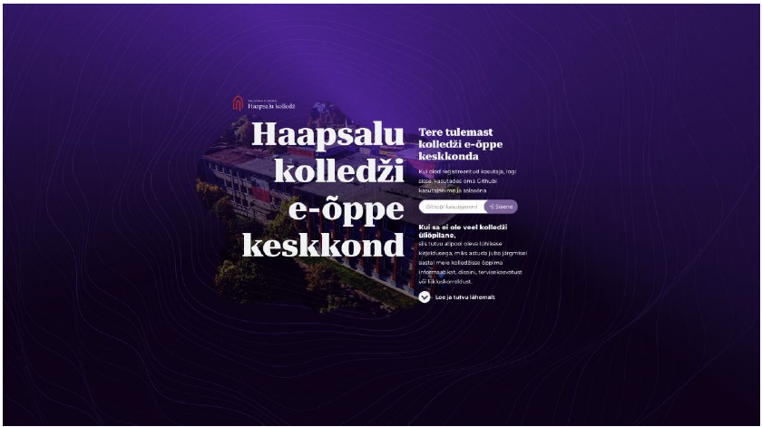

# HAAPSALU KOLLEDŽI E-ÕPPE PLATVORMI ESIRAKENDUSE LOOMINE KOOS DISAINI JA ESIRAKENDUSE KOODI SÜNKRONISEERIMISEGA

**Autor**: Juho Kalberg

**Juhendaja**: MSc Priidu Paomets

## SISSEJUHATUS
21\. sajandi ülikool ja õppimine on seoses tehnika arenguga jõudnud etappi, kus suur osa õppest toimub interneti vahendusel (Chernev, 2023) (Rungta, 2023). Eriti kiirendas sellise õppevormi kasutuselevõttu ja sellega harjumist Covid19 aegne olukord (World Economic Forum, 2020) (Swiss School of Business and Management Geneva, 2022).

Haapsalu kolledž ei ole selles osas erand. Tuntumad kolledži õpetajate poolt kasutatavatest e-õppe keskkondadest on Moodle1, Google Classroom2 ja Cisco Academy3 ning Haapsalu kolledži enda materjalide hoidla Sahtel4. Lisaks kasutavad üliõpilased omal valikul Udemy´t5, Skillshare6, Pluralsight’i7 jms.

Haapsalu kolledži jaoks on need keskkonnad kas liiga suured, nagu nt Moodle ja Google Classroom või liiga ainespetsiifilised, nagu Cisco Academy. Siinse diplomitöö ja sellele eelnenud valikpraktika kursuse raames läbiviidud intervjuudest ja küsitlustest järeldub, et kolledži senine e-õppe korraldus toimub moel, kus iga õppejõud valib ise, kuidas ta oma töö korraldab, milliseid abivahendeid, sh e-õppe keskkondi kasutab. Tagajärjeks on erinevate õpikeskkondade paljusus, mis muudab õpingute ja kursuste järgimise keeruliseks. Üliõpilastel peab olema konto mitmes erinevas keskkonnas, mistõttu järje hoidmine oma õpingutel on keeruline ja asjad võivad ununeda.
Samuti puudub kolledžil kontroll võimalike lahenduste rakendusliidese üle, mistõttu ei saa kursust koostada täielikult oma äranägemise järgi ega selle sisu integreerida ka muudesse või tulevikus loodavatesse rakendustesse.

Eelnevast lähtuvalt esitas kolledž 2022. aasta sügissemestril valikpraktika raames üliõpilastele tellimuse, töötada välja kolledžile sobiv ja ühtne e-kursuste platvorm. Selle töö käigus jõuti valmis Githubis hallatava ainekursuste süsteemiga ning selle kuvamisega eraldi veebilehel.

Siinne diplomitöö on järgmine etapp, mille eesmärgiks on Haapsalu kolledži õppetöös kasutatav, sisselogimist võimaldav, kasutajate arengut salvestav ning kuvav ja üliõpilaste õppetöös kasutatav süsteem. Diplomitöö on osa tervikust, millega arendatakse valmis esirakendus ja disain. Esimesest etapist saadud kogemus ja valminud rakendusest saadud tagasiside põhjal on lisaeesmärgiks seatud kiiremat arendusprotsessi võimaldava disaini ja esirakenduse sünkroniseeritud süsteem.

### Uurimisküsimused
- kuidas peab lõppkasutaja saama rakendust kasutada;
- millised on nõuded disainile;
- milline on parim esirakenduse ja disaini haldamise töökorraldus.

### Uurimisülesanded:
- luua disainifail sellisel moel, et see ühtiks tehniliselt esirakendusega;
- luua esirakendus, mis on seadistatud võtma vastu disainist saadetud koodi;
- kirjeldada, milliseid tehnilisi abivahendeid on kogu protsessiks vaja;
- kirjeldada, milliselt võiks olla üles ehitatud disainifail, mida on võimalik automaatselt esirakenduse koodi viia;
- uurida välja kasutajate seisukohad disaini suhtes;
- luua esirakenduse disain;
- kirjeldada sellise töökorraldusega seotud kitsaskohad, millal selline korraldus sobib ja millal mitte.

Tellija soovide ja tingimuste välja selgitamiseks kasutati intervjuusid, lõppkasutajate eelistuste väljaselgitamiseks poolstruktureeritud intervjuusid ja küsitlusi. Samuti viidi läbi testid valikpraktika raames valminud rakendusega, selgitamaks välja lõppkasutaja hakkamasaamine rakenduses.

Diplomitöö koosneb sissejuhatusest, kolmest põhipeatükist, kahekümne ühest alampeatükist ning kokkuvõttest, milles esitatakse järeldused ja soovitused. Esimeses peatükis kirjeldan eeltöid ja seda, kuidas ja miks ma valitud eesmärgi seadsin. Teises peatükis kirjeldan tellija nõudmisi ja kasutajate eelistusi. Kolmandas peatükis kirjeldan disainivalikuid ning kuidas ma rakenduse lõin.

### Diplomitöö täistekst
[Täistekst pdf-failina](./Ainekursus_disain.pdf)