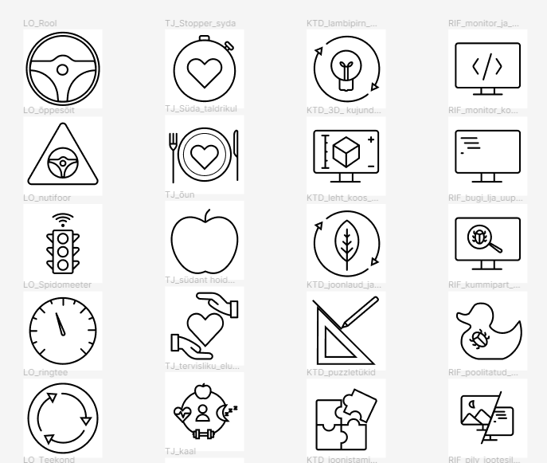

# IKOONIKOMPLEKTI LOOMINE HAAPSALU KOLLEDŽILE

**Autor**: Tiina Kukli

**Juhendaja**: MA Laura Hein

## SISSEJUHATUS
Ikoonid käesoleva diplomitöö tähenduses on arvutimaailmas kasutatavad teksti asendavad piltkujutised. Ikoonid on oluline osa tänapäeva maailmast, nad väljendavad visuaalselt objekte, tegevusi või ideid ning on tuttavad pea igalt kodulehelt, nutiseadmest või lennujaamast (Babich, 2016). Ikoone kasutatakse laialdaselt, kuna tekstiga võrreldes saab nende abil lihtsamini väljendada tegevusi, objekte või ideid (Collaud et al. 2022).

Haapsalu kolledžil oli ettepanek luua diplomitöö raames koolile omanäoline ja ühtse stiiliga ikoonide komplekt, mis kataks erialade lõikes erinevaid kasutusvaldkondi. Ikoonide teemat ei kajastata Tallinna Ülikooli stiiliraamatus (Tallinna Ülikool, 2017), kuid uute ikoonide loomisel tuleb arvestada Haapsalu kolledži kodulehel kasutusel olevate ikoonidega ja nende stiiliga. Ehkki veebist on võimalik leida nii tasuta kui tasuliselt kõikvõimalikke ikoone, on vähetõenäoline või isegi võimatu leida ühtses stiilis lahendust, mis kataks Haapsalu kolledži kõikide erinevate erialade ja tegevusvaldkondade vajadused, sobitudes seejuures juba olemasoleva stilistikaga.

Uute ikoonide loomise eeliseks on ka järjepidevus – määrates ära ikoonide stiilireeglid, luues malli ning andes kolledžile üle tööfailid, on võimalik uute vajaduste või kasutuseesmärkide tekkimisel ikoone suhteliselt väikese vaevaga juurde kujundada.
Diplomitöö eesmärk on luua Haapsalu kolledži jaoks ikoonikomplekt, mis võiks olla aluseks kolledžile ühtse ja isikupärase visuaalse ikoonistiili loomisel. Lisaks ikoonidele valmib ka mall ja määratakse ikoonide parameetrid, mille alusel saab edaspidi ikoone juurde luua või vastavalt vajadusele muuta.

### Uurimisküsimused:
- Millised on ikoonide loomise põhiprintsiibid?
- Millised on Haapsalu kolledži vajadused ja ootused ikoonidele ning kus neid plaanitakse kasutada?
- Milliste tehniliste nõuetega tuleb arvestada ikoonide loomisel?

### Uurimisülesanded:
- Tutvuda ikoonide loomise alusteooriate ja parimate tehniliste praktikatega.
- Tutvuda Tallinna Ülikooli ja Haapsalu kolledži poolt seni kasutusel olevate ikoonidega ja viia läbi intervjuud kolledži erialade esindajatega.
- Luua Haapsalu kolledži vajadusi arvestav ikoonikomplekt ja mall.

Diplomitöö jaguneb kolmeks peatükiks, millest esimeses, teoreetilises osas käsitletakse ikoonide loomise printsiipe ja parimaid praktikaid. Teine osa kajastab intervjuusid kolledži esindajatega, kokkuvõtet intervjuudest ja ikooniauditi tulemusi ning kolmas osa keskendub ikoonide loomise praktilisele protsessile koos illustreeriva materjaliga.

### Diplomitöö täistekst
[Täistekst pdf-failina](./Ikoonikomplekt.pdf)