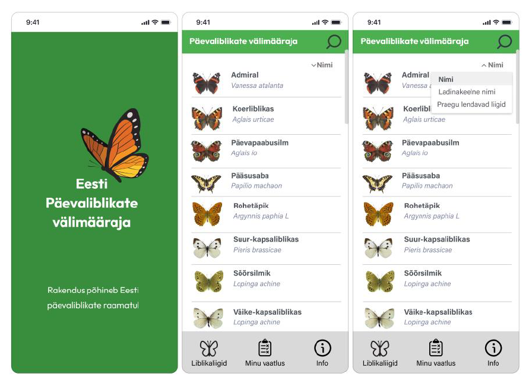

# PÄEVALIBLIKATE VÄLIMÄÄRAJA PROTOTÜÜBI LOOMINE

**Autor**: Laura Õun

**Juhendaja**: MA Laura Hein

## SISSEJUHATUS
Ilusaid, värvilisi liblikaid on Eestis palju. Eesti päevaliblikate raamatu (2014) andmete järgi võib Eestis regulaarselt leida ligikaudu 100 liiki päevaliblikaid. Päevaliblikad on ühed kõige pilkupüüdvamad ja silmatorkavamad putukad. Kehamõõtmete ja hästimärgatavate liigitunnuste tõttu on päevaliblikaid looduses lihtne jälgida ja määrata.

Veebipõhisel suhtlusplatvormil Facebook on loodud liblikahuviliste grupp nimega „Eesti liblikad - Butterflies and Moths of Estonia“, millel on üle 3500 jälgija (link). Ehkki liblikahuvilisi on palju, puudub Eesti liblikate välimääramist võimaldav rakendus.

Liblikate kaitsmine on kõige tulemuslikum nende teadvustamise ja seeläbi ka elupaikade kaitse kaudu (Tartes et al., 2014). Eesti päevaliblikate välimääraja mobiilse rakenduse prototüüp annab parema võimaluse Eesti liblikafauna tundma saamisele ja toetab liblikahuvilist neist rohkem teada saama, mis omakorda aitab kaasa nende kaitsele ja säilimisele.
Diplomitöö eesmärk on Eesti päevaliblikate välimääramise rakenduse jaoks vajaliku teabe kogumine ning rakenduse infoarhitektuuri ja prototüübi loomine.

### Diplomitöö uurimisküsimused on:
1. Missuguste tunnuste abil liblikaid määratakse ja millistest sammudest välimääramise protsess koosneb?
2. Missuguseid liblikate välimääramisrakendusi rahvusvaheliselt leidub?
3. Milline peaks olema liblikate välimääramist võimaldava rakenduse prototüübi ülesehitus?
4. Millised on rakenduse infoarhitektuuri loomise head tavad ja töövõtted?

### Diplomitöö uurimisküsimustest tulenevalt püstitasin järgmised uurimisülesanded:
5. Tutvuda liblikate välimääramise tööprotsessi ja liblikate määramiseks oluliste visuaalsete tunnustega;
6. Uurida valmisolevaid rahvusvahelisi lahendusi;
7. Tutvuda infoarhitektuuri loomise alusteooriate, heade tavade ja praktikatega;
8. Luua liblikate välimääramist võimaldava rakendusele infoarhitektuur ja prototüüp.

Diplomitöö koosneb kolmest peatükist. Esimeses peatükis annan ülevaate liblikatest ja olemasolevatest rahvusvahelistest rakendustest liblikate välimääramiseks. Teises peatükis käsitlen informatsiooni arhitektuuri loomise põhimõtteid, infosisu korraldamist, selle rühmitamist ja järjestamist ning kasutajaliidese disainipõhimõtteid. Kolmas peatükk keskendub rakenduse prototüübi loomisele, selle infoarhitektuurile, valminud prototüübi kirjeldusele ning annab ülevaate valminud detailse prototüübi testimisest.

### Diplomitöö täistekst
[Täistekst pdf-failina](./Diplomitöö_Laura_Õun.pdf)