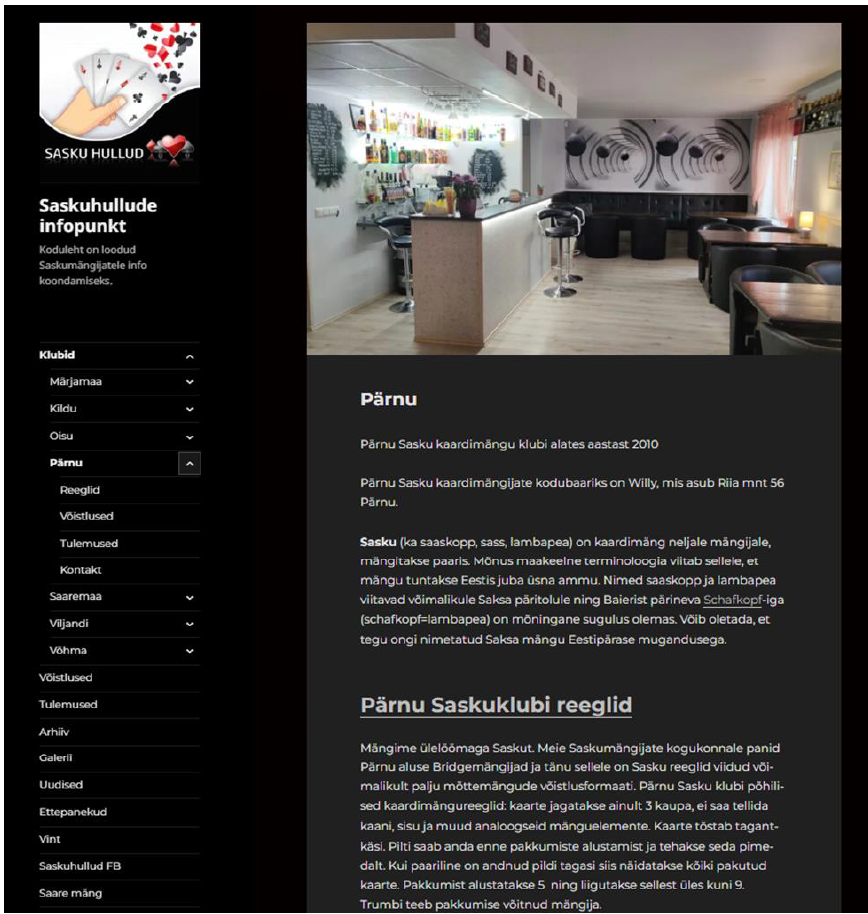

# ÜLE-EESTILISE SASKUMÄNGIJATE KODULEHE PROTOTÜÜBI LOOMINE

**Autor**: Kristi Pruul

**Juhendaja**: MA Martti Raavel

## SISSEJUHATUS
“On vaba päev ja ma ei suuda töömõtteid välja lülitada. Selle nädala töösündmused ja järgmise nädala kohustused kriibivad kuklas ning ma tahaks juba kohe pihta hakata, muidu ei jõua ju kindlasti valmis. Kas ülal olevad mõtted kõlavad tuttavalt? Oleme kõik kogenud tööga seotud stressi, pinget, liiga suurt koormust ning soovi, et puhkehetked juba kiiremini saabuksid ja siis päriselt ka tööga seotud mõtetest puhata saaks.“ (Peaasjad MTÜ, s.a.) Järjest kiireneva elutempoga hakkama saamiseks vajab igaüks aeg-ajalt väikest lõõgastust argipäevamuredest välja tulemiseks ning üks võimalus selleks on tegeleda mõtte- sealhulgas kaardimängudega (The Australian & New Zealand Mental Health Association, 2019)(IANS, 2022). Üheks mõttespordi alaliigiks on saanud kaardimäng sasku, mida harrastatakse laialdaselt üle Eesti.

Sasku (nimetatakse ka saskop, sass, lambapea) on kaardimäng neljale mängijale, mida mängitakse paaris. Mängu nimed saskop ja lambapea viitavad Saksa päritolule ning ühtseid jooni võib leida Baierist pärineva Schafkopf-iga (schafkopf=lambapea). (Schafkopfschule, 2004) Sellest lähtuvalt võib öelda, et tegemist on Saksa mängu eestipärase mugandusega. 

Aktiivseid mängijaid Eestis on palju, kuid enamasti harrastatakse seda väiksemates kogukondades või pereringis. Mitmetes Eesti piirkondades on sasku hobi tasemest välja kasvanud võistlussport ning peetakse ka korrapäraseid võistluseid. Paraku võistlustel osalevad inimesed on piirkonniti enamasti ühed ja samad ning selle põhjuseks on info püsimine väikeses kogukonnas. Sellest lähtuvalt, olles ise nii võistluste korraldaja kui ka aktiivne harrastaja, võin kinnitada, et suurimaks probleemiks Eestis on hetkel võistluste ja klubide tegevuse info killustatus. Puudub maakondade vaheline ühtne infovahetuskanal, kus jagataks teavet klubide, reeglite, toimuvate mängupäevade, võistluste ja tulemuste kohta. Enamasti liigub info inimeselt inimesele kas suuliselt, e-maili teel või korraldajate poolt loodud erinevates kinnistes Facebooki gruppides. Ainukesena Eestis on veebipõhine koduleht kasutuses Saaremaa klubil, kus on kirjas võistluskalender koos tulemuste ja mängureeglitega.

Käesoleva diplomitöö eesmärgiks on välja uurida, milliseid infovahetuskanaleid saskumängu võistluste korraldajad ja mängijad hetkel Eestis kasutavad ning kas üle-eestilise infokanali loomine suurendaks mängijate osalemist teiste piirkondade võistlustel. Diplomitöö eesmärgiks on lahendada võistlusi puudutava info vahetamise killustatus ning koondada klubide omavaheline suhtlus ühte keskkonda.

### Uurimisküsimused:
- Milliseid infovahetuskanaleid kasutavad võistluste korraldajad mängijatele info edastamiseks?
- Kas selliste infokanalite kasutamine on piisav või milliseid puuduseid on esinenud?
- Millised võimalused võiksid olla uuel veebirakendusel, et see täidaks võimalikult paljude kasutajate vajadused ning oleks piisavalt kasutajasõbralik?

### Uurimisülesanded:
- selgitada välja Saskopi klubide eestvedajate ja kogukondade poolt praegu kasutatavad infokanalid;
- millised on kasutuses olevate infokanalite puudused;
- selgitada välja, milliseid funktsioone soovivad nii võistluste korraldajad kui ka mängijad kasutada üle-eestilises infovahetuskanalis.

Diplomitöö koosneb viiest peatükist, sissejuhatusest ja kokkuvõttest. Esimeses, teoreetiliste aluste peatükis, antakse ülevaade saskumängu olemusest, klubidest, reeglistikest ja kirjeldatakse kodulehe arendamise etappe. Teises peatükis tutvustatakse metoodikaid, mida käesolevas töös on kasutatud. Kolmas peatükk annab ülevaate läbi viidud intervjuudest ja küsitlustest, mis kaardistavad saskumängijate kasutuses olevad suhtluskanalid, koos analüüsi ning kokkuvõttega. Viiendas peatükis kirjeldatakse uue kodulehe loomise etappe. Kuuendas peatükis kirjeldatakse kodulehe prototüübi loomist, testimist ning tuleviku võimalusi.

### Diplomitöö täistekst
[Täistekst pdf-failina](./Sasku.pdf)