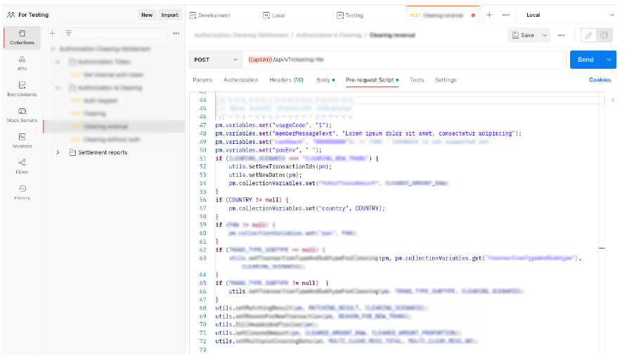

# RAKENDUSLIIDESTE REGRESSIOONITESTIMISE AUTOMATISEERIMINE

**Autor**: Taaniel Levin

**Juhendaja**: MSc Andrus Rinde

## SISSEJUHATUS
Rakendusliideste testimine on aktuaalne teema, kuna testimine on tarkvaraarenduse kvaliteedi tagamisel väga oluline osa. Tarkvara peaks olema töökindel ning veavaba, et lõppkasutajal tekiks tarkvara kasutamisel võimalikult vähe probleeme. Suurtes arendusprojektides on tähtis, et lisaks manuaalsele testimisele oleks olemas ka hästi koostatud automaattestide süsteem, mis tagab varem arendatud osa kiire testimise ja aitab tagada selle funktsioneerimise ka peale uusi muudatusi. Viimasel ajal luuakse üha rohkem tarkvararakendusi, mis integreeruvad teiste rakendustega, platvormidega ja süsteemidega. Rakendusliides on tarkvara komponent, mis võimaldab erinevatel rakendustel omavahel suhelda ja andmeid vahetada. Kuna rakendused muutuvad üha keerukamaks ja sisaldavad aina rohkem rakendusliideseid, on oluline tagada nende liideste usaldusväärsus ja tõrgeteta toimimine. Rakendusliideste testimine on oluline tagamiseks, et erinevad rakendused suhtlevad omavahel õigesti ja tõrgeteta ning et andmeid vahetatakse turvaliselt ja õiges vormingus.

Sellist tüüpi testimist, mille eesmärk on veenduda, et uued koodimuudatused ei kahjusta juba eksisteerivat arendust, nimetatakse regressioonitestimiseks. See kindlustab kogu tarkvara toimimise ning on efektiivne vahend hoidmaks ära vigu tarkvaras (Software Testing Help,
2022). Regressioonitestimine tähendab sisuliselt seda, et ideaalis testitakse läbi kogu tarkvara kood. Selleks luuakse eraldi testide süsteem, kuhu kirjutatakse automaatteste, mis võiks katta ära võimalikult suure osa tarkvara funktsionaalsusest.

Töö autor töötab organisatsioonis, kus on kasutusel mahukas monoliitse arhitektuuriga pangandustarkvara. Tarkvaras esineb palju vigu, mille üheks põhjuseks on olemasoleva automaattestimissüsteemi ebaefektiivsus, kuna süsteem ei kata piisavalt palju koodi ning vähe on kaetud ka erinevaid teststsenaariumeid.

Diplomitöös käsitletakse regressioonitestimist just seepärast, et organisatsioonis on tavaks saanud iganädalane uue tarkvaraversiooni väljastus. Seetõttu on kehtestatud nõue kasutada uue versiooni kontrollimisel regressiooniteste, et veenduda selle kvaliteedis.

Diplomitöö eesmärk on töötada välja efektiivsem rakendusliideste regressioontestimise tarbeks mõeldud testimissüsteem autori tööandja näitel. Töö eeskujul on võimalik ka teistel inimestel ja organisatsioonidel koostada tõhus automaattestimissüsteem, et rakenduse kõrge kvaliteet oleks kontrollitud ja igal ajal oleks võimalik veenduda tarkvara toimimises ning uute arenduste võimalike vigade vältimises.

### Uurimisküsimused:
- Millised eelised on regressioonitestidel rakendusliidestese testimisel võrreldes teiste testimismetoodikatega?
- Milliste vahenditega saab muuta regressiooniteste võimalikult efektiivseks?
- Milliseid tööriistu tuleks eelistada automaattestide loomisel?

### Uurimisülesanded:
- võrrelda erinevaid testimisraamistikke, tööriistu ja metoodikaid, viia läbi katsetused, teha analüüs ning järeldused;
- selgitada välja vahendid ja meetodid regressioonitestide efektiivsuse tagamiseks;
- koguda materjali regressioonitestide efektiivsemaks muutmise kohta ning viia ise läbi katsetused, neid analüüsida ning teha järeldused.

Uurimistöös käsitletakse tarkvara testimist üldiselt ning põhjalikumalt just rakendusliideste
automaattestimist. Töö autor võrdleb erinevaid automaattestimise metoodikaid ning selleks
kasutatavaid tööriistu, protsesse ning testimisraamistikke. Autor täiustab oma töökohas
kasutusel olevat rakendusliideste testimissüsteemi uute testidega ning lisab koodinäiteid.
Analüüsib tehtut ning põhjendab näidetega, kuidas loodud arendus süsteemi täiustab ning mille
tulemusel on tarkvara veakindlam ja toimekam.

### Diplomitöö täistekst
[Täistekst pdf-failina](./Testimine.pdf)