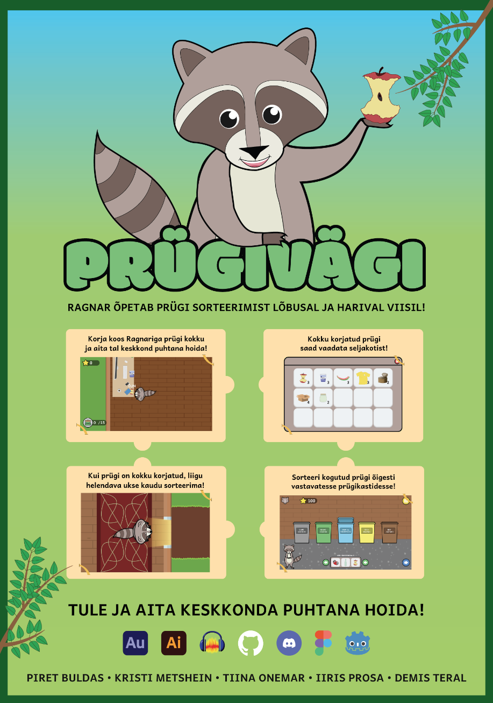
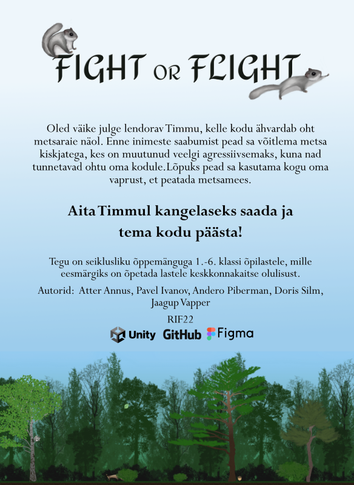

# Rakendusinformaatika eriala praktikates tehtud tööd

## Multimeediumi praktika 2024

### Arvutimäng Escape from Piggy Island
<table>
  <tr>
    <td></td>
    <td>"Escape from Piggy Island" mängu eesmärk on võimaldada mängijatel sukelduda põnevasse seiklusmaailma, kus nad saavad kogeda mitmekesiseid väljakutseid, lahendada loomingulisi mõistatusi ning arendada oma oskusi ja strateegilist mõtlemist. Mäng soovib pakkuda nauditavat ja mitmekülgset mängukogemust. Kuna antud meeskonna arust on liiga palju juba kaasaegseid mänge, otsutas antud meeskond luua retro mängu, mis pärineks justkui otse 90ndatest, kui mängukultuur laiemalt antud riigis levima hakkas..</td>
  </tr>
</table>

[Mängu repositoorium](https://github.com/TLUHK-RIF22/multimeediumi_praktika_Ryhm_1)

### Arvutimäng Prügivägi

<table>
  <tr>
    <td></td>
    <td>"Prügivägi" on 2D õppemäng prügisorteerimise kohta. Mängu peategelane on pesukaru Ragnar, kes õpetab mängijale prügi sorteerima.
    </td>
  </tr>
</table>

[Mängu repositoorium](https://github.com/TLUHK-RIF22/Oppemang-Prugivagi)

### Arvutimäng "Fight or Flight"

<table>
  <tr>
    <td></td>
    <td>Projekt on loodud multimeediumi praktika raames. Projekti eesmärgiks on luua õppemäng, mis on suunatud 1.-6. klassi õpilastele. Mängu nimi on "Fight or Flight" ja selle žanriks on seikluslik õppemäng. Mängu kangelaseks on lendorav Timmu, kes sai oma nime maineka lendorava uurija – Uudo Timm järgi. Mängu eesmärgiks on õpetada lastele keskkonnakaitse ja looduse olulisust. Lisaks sellele, et lendoravat peetakse Eestis looduskaitse sümboliks, on ta valitud aasta loomaks 2023.
    </td>
  </tr>
</table>

[Mängu repositoorium](https://github.com/TLUHK-RIF22/Team-4)

## Multimeediumi praktika 2023

### Arvutimäng Mina Tean!

<table>
  <tr>
    <td></td>
    <td>Mängu Mina tean! käigus peab mängija liikuma klassiruumides ning edasi pääsemiseks tuleb mängijal lahendada ülesandeid. Mängija valib tahvlilt vastuse kolme vastusevariandi seast. Õige vastuse korral avaneb uks ja mängija saab edasi liikuda järgmise ülesande juurde, vale vastuse korral saab mängija uuesti vastata niikaua, kui saab õige vastuse. Iga ülesande eest saab karika vastavalt sellele, mitmendal korral õigesti vastas. Mängu tulemusest sõltub, kas ta saab järgmisele tasemele.</td>
  </tr>
</table>

[Mängu repositoorium](https://github.com/TLUHK-Portfolio/Mina-Tean)

## Arvutimäng Babushka&griZZly

<table>
  <tr>
    <td></td>
    <td>„Babushka ja GriZZly“ on arvutis mängitav meelelahutusmäng kahe võimsa vastase vahel, kus mõlemad tegelased viskavad üksteise suunas esemeid. Rünnakud toimuvad kordamööda, kus mõlemal tegelasel on võimalus visata üks objekt korraga, luues dünaamilise ja põneva mängurütmi. Mängija on Babushka rollis ning tema eesmärk on olla täpsem kui GriZZly. </td>
  </tr>
</table>

[Mängu repositoorium](https://github.com/TLUHK-Portfolio/Babushka-and-griZZly)

## Arvutimäng Tudengiralli

<table>
  <tr>
    <td></td>
    <td>Tudengiralli on 2D platvormtüüpi arvutimäng, kus mängija eesmärk on võimalikult kiiresti jõuda leveli algusest finišisse. Finiš avaneb alles siis, kui mängija on läbinud kõik vahepunktid ja kogunud nendest esemed. Mõned vahepunktid nõuavad batuutide kasutamist, et jõuda piisavalt kõrgele.</td>
  </tr>
</table>

[Mängu repositoorium](https://github.com/TLUHK-Portfolio/Tudengiralli)
